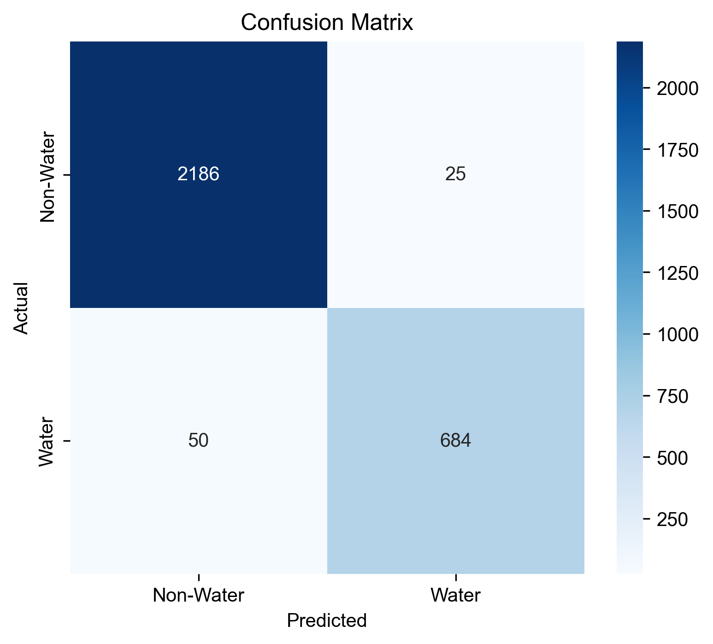

# GEE-CNN-Alpha: Water Body Detection using CNN with AlphaEarth and Sentinel-2

This project combines Google Earth Engine (GEE), Convolutional Neural Networks (CNN), and AlphaEarth embeddings for accurate water body detection using multi-source remote sensing data.

## 🌟 Features

- **Multi-source Data Fusion**: Combines AlphaEarth high-dimensional features with Sentinel-2 multispectral bands
- **CNN Architecture**: Custom 3×3 window CNN model for water body classification
- **High Accuracy**: Achieves 97.18% validation accuracy
- **Feature Selection**: SHAP analysis to identify the most important AlphaEarth bands
- **End-to-End Pipeline**: From data extraction to model training and evaluation

## 📊 Model Performance

- **Validation Accuracy**: 97.18%
- **Non-Water Class**: Precision 97%, Recall 99%, F1-Score 98%
- **Water Class**: Precision 96%, Recall 92%, F1-Score 94%
- **Model Parameters**: 408,898 parameters

## 🗂️ Project Structure

```
GEE-CNN-Alpha/
├── code/                           # Source code and notebooks
│   ├── geeCNN_Water_sampleExport.ipynb    # GEE data extraction
│   ├── batch_water_CNN_sequential.ipynb   # Batch data export
│   ├── geeCNN_Water_Classification.ipynb  # Original classification notebook
│   └── feature_selection_shap.py          # SHAP feature importance analysis
├── data/                           # Data files
│   ├── AlphaEarth/                # AlphaEarth data (excluded from repo)
│   ├── pnt.shp                    # Training points shapefile
│   ├── water_CNN_with_AlphaEarth_all_merged.csv  # Merged training data
│   ├── alphaearth_extracted_values.csv           # Extracted AlphaEarth values
│   └── top_5_alpha_features.csv   # Top 5 important AlphaEarth features
├── model/                          # Trained models and results
│   ├── water_cnn_alpha_model.pth  # Trained CNN model
│   ├── training_curves.png        # Training/validation curves
│   └── confusion_matrix.png       # Confusion matrix
├── fig/                           # Figures and visualizations
├── docs/                          # Documentation
├── train_CNN_Alpha.py             # Main training script
├── extract_alphaearth_values.py   # AlphaEarth extraction script
└── README.md                      # This file
```

## 🚀 Quick Start

### Prerequisites

```bash
# Create conda environment
conda create -n gee-cnn python=3.9
conda activate gee-cnn

# Install required packages
pip install torch torchvision
pip install pandas numpy matplotlib seaborn
pip install scikit-learn
pip install geopandas rioxarray
pip install earthengine-api geemap
pip install shap
```

### 1. Data Preparation

```bash
# Extract AlphaEarth values at training points
python extract_alphaearth_values.py

# Run feature selection analysis
python code/feature_selection_shap.py
```

### 2. Model Training

```bash
# Train the CNN model
python train_CNN_Alpha.py
```

### 3. GEE Data Export

Use the Jupyter notebooks in the `code/` directory:
- `geeCNN_Water_sampleExport.ipynb`: Extract training samples
- `batch_water_CNN_sequential.ipynb`: Batch export for large datasets

## 📈 Methodology

### 1. Data Sources
- **AlphaEarth**: 64-dimensional satellite embeddings (5 most important bands selected)
- **Sentinel-2**: 10 multispectral bands (B2, B3, B4, B5, B6, B7, B8, B8A, B11, B12)
- **Training Labels**: Water body classification (0: Non-water, 1: Water)

### 2. Feature Selection
- Random Forest + SHAP analysis to identify top 5 AlphaEarth bands
- Selected bands: Alpha32, Alpha64, Alpha37, Alpha48, Alpha47

### 3. CNN Architecture
```
Input: 15 channels × 3×3 window
├── Conv2D(15→32) + BatchNorm + ReLU
├── Conv2D(32→64) + BatchNorm + ReLU  
├── Conv2D(64→128) + BatchNorm + ReLU
├── Flatten
├── Linear(1152→256) + Dropout(0.5)
├── Linear(256→64) + Dropout(0.3)
└── Linear(64→2) [Output]
```

### 4. Training Configuration
- **Optimizer**: Adam (lr=0.001, weight_decay=1e-4)
- **Loss Function**: CrossEntropyLoss
- **Batch Size**: 32
- **Epochs**: 50
- **Learning Rate Schedule**: StepLR (step_size=10, gamma=0.5)

## 📊 Results

### Training Curves


### Confusion Matrix


### Feature Importance


## 🔬 Key Innovations

1. **Multi-source Fusion**: First to combine AlphaEarth embeddings with Sentinel-2 for water detection
2. **Feature Selection**: SHAP-based selection of optimal AlphaEarth bands
3. **Efficient Architecture**: Lightweight CNN optimized for 3×3 windows
4. **High Performance**: 97%+ accuracy with balanced precision/recall

## 📝 Citation

If you use this work in your research, please cite:

```bibtex
@misc{gee-cnn-alpha2024,
  title={Water Body Detection using CNN with AlphaEarth and Sentinel-2},
  author={Your Name},
  year={2024},
  url={https://github.com/GISWLH/GEE-CNN-Alpha}
}
```

## 🤝 Contributing

Contributions are welcome! Please feel free to submit a Pull Request.

## 📄 License

This project is licensed under the MIT License - see the [LICENSE](LICENSE) file for details.

## 🙏 Acknowledgments

- Google Earth Engine for satellite data access
- AlphaEarth team for the embedding dataset
- ESA for Sentinel-2 data
- PyTorch team for the deep learning framework

## 📧 Contact

For questions or collaborations, please open an issue or contact [hhuwlh@163.com].
